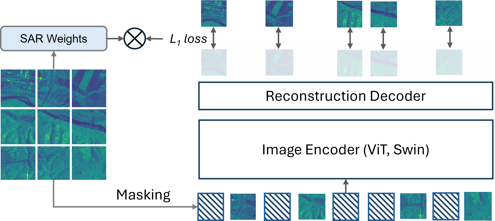
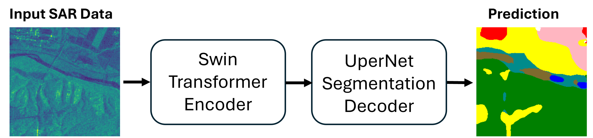

# SAR-W-SimMIM
[ALOS-2](https://www.eorc.jaxa.jp/ALOS-2/en/about/palsar2.htm) data pretraining using SimMIM with SAR weighted loss and finetuning for Segmentation with [JAXA LULC](https://www.eorc.jaxa.jp/ALOS/en/dataset/lulc_e.htm#download) labels  

By [Nevrez Imamoglu](https://github.com/nevrez)\*, [Ali Caglayan](https://acaglayan.github.io/)\*, [Toru Kouyama](https://sites.google.com/site/kouyamaterra/home).


This repository provides the official implementation of **SAR Weighted SimMIM (SAR-W-SimMIM)** described in:

> *A Tutorial on ALOS2 SAR Utilization: Dataset Preparation, Self-Supervised Pretraining, and Semantic Segmentation*  
> https://arxiv.org/abs/2603.15119


The repository includes both:
- Self-supervised **pretraining on [ALOS-2](https://www.eorc.jaxa.jp/ALOS-2/en/about/palsar2.htm) SAR data**
- Downstream **segmentation fine-tuning using [JAXA LULC](https://www.eorc.jaxa.jp/ALOS/en/dataset/lulc_e.htm#download)**

> *Nevrez Imamoglu and Ali Caglayan has contributed to this work (both research and repository) equally as co-first authors.
---

## 📂 Repository Contents

1. SAR-W-SimMIM pretraining code (Self-supervised pretraining on ALOS-2 SAR imageryg) with SAR-aware weighted reconstruction loss for SimMIM
2. Segmentation pipeline for JAXA-LULC datasets
3. Dataset handling utilities for ALOS-2 SAR
4. Evaluation metrics (mIoU, mAcc, PixelAcc)
5. Visualization utilities for reconstruction and segmentation outputs

---


## Introduction
Approaches such as masked auto-encoders (MAE) and their derivatives have demonstrated efficacy in applications to satellite imagery. In remote sensing, most ongoing technical validation of foundation models has focused on optical data, such as RGB or multi-spectral images. Synthetic aperture radar (SAR) data, however, remains less explored due to two primary challenges: (1) the difficulty of semantic labeling for dataset creation, and (2) the inherently higher noise content compared to optical imagery. In our previous work, we took advantage of MixMAE \cite{liu2023mixmae}, a variant of masked auto-encoder that mixes two images for masked regions, and extended it by leveraging SAR-specific physical characteristics to apply intensity-based weighting (**SAR-W-MixMAE** described in [ieee jstars](https://ieeexplore.ieee.org/abstract/document/11344788), [segmentation-arxiv](https://arxiv.org/abs/2601.15705)) to the auto-encoder training loss (mean absolute error).

In this study, we extend this concept to a more standard masked auto-encoder variant, **SimMIM** in [simimim-arxiv](https://arxiv.org/abs/2111.09886) (where masked regions are zeroed), applied to ALOS-2 single-channel SAR imagery. Our approach, SAR-W-SimMIM, aims to mitigate the impact of speckle and extreme intensity values in SAR images. The primary objective is to evaluate the effect of self-supervised pretraining with SimMIM on semantic segmentation of SAR data and compare results against SAR-W-MixMAE [ieee jstars](https://ieeexplore.ieee.org/abstract/document/11344788) and randomly initialized models. The SAR intensity-based weighting of the reconstruction loss has yielded encouraging results in both self-supervised SAR pretraining and downstream segmentation tasks.

<div align="center">
    
</div>

## Main Results on Segmentation Downstream task with JAXA-LULC Data

<div align="center">
    
</div>

### Swin Transformer Backbone

**ALOS2 SAR Images Pre-trained and Fine-tuned Models**

| name | pre-train epochs | pre-train resolution | fine-tune resolution | mAcc | mIoU |pre-trained encoder weights |pre-trained decoder weights | fine-tuned weights |
| :---: | :---: | :---: | :---: | :---: | :---: | :---: | :---: | :---: |
| Swin-Base | 800 | 256x256 | 256x256 | 0.6073 | 0.4898 | [SAR-W-SimMIM encoder weights](https://huggingface.co/gsvrg/ALOS-2_FM/tree/main/model_weights_simmim_pretrain) | / | [Segmentation weights](https://huggingface.co/gsvrg/ALOS-2_FM/tree/main/model_weights_finetuning_segmenation) |


### Pretrained Encoder Weights

`sar_w_simim_encoder.pth` contains only the pretrained encoder
state_dict and is intended for downstream fine-tuning tasks such as
semantic segmentation, classification, and detection.

The SimMIM decoder, optimizer state, scheduler state, and other
pretraining metadata are intentionally not distributed.

The current `load_pretrained()` implementation in `utils.py` supports both encoder-only
weights and full SimMIM checkpoints.


## Dataset Split Files

The original SAR-W-SimMIM experiments used dataset split files located
under the repository's `data/` directory:

```text
data/
├── 2022_fall_pretraining_no_forest.csv
├── 2022_fall_train_no_forest.csv
├── 2022_fall_val_no_forest.csv
└── 2022_fall_test_no_forest.csv
```

These CSV files are intentionally not distributed because they contain dataset-specific metadata, including acquisition dates, file locations, and geographic information associated with individual ALOS-2 patches.

Users should generate their own CSV files and place them under the repository's `data/` directory.

For pretraining, each row contains metadata describing a single SAR patch.

Example schema:
```text
| Year | Month | Day | FolderPath | FileName | MinLon | MinLat | MaxLon | MaxLat | Latitude | Longitude | Category |
|------|--------|-----|------------|----------|---------|---------|---------|---------|----------|-----------|----------|
| 2022 | 11 | 19 | 2022/11/19 | IMG-HH-ALOS2458503210-221119-UBSR2.1GUD_12032_7680.tif | 136.0570 | 20.4170 | 136.0694 | 20.4285 | 20.4253 | 136.0683 | 10 |
| 2022 | 10 | 22 | 2022/10/22 | IMG-HH-ALOS2454363210-221022-UBSR2.1GUD_1280_7168.tif | 136.0374 | 20.9027 | 136.0498 | 20.9142 | 20.9102 | 136.0452 | 1 |
```

### Field Descriptions

- **Year, Month, Day**: Acquisition date of the ALOS-2 scene.
- **FolderPath**: Relative folder location of the SAR patch.
- **FileName**: Patch filename.
- **MinLon, MinLat, MaxLon, MaxLat**: Geographic bounding box coordinates of the patch.
- **Latitude, Longitude**: coordinates of the sampled patch location.
- **Category**: Land-cover category label of the sampled patch location.

The current implementation uses the acquisition date and filename information to construct the patch path:

```text
<data_root>/<year>/<month>/<day>/<filename>
```

The remaining metadata fields are retained for dataset organisation and analysis and geographic indexing purposes.

The original split files are not included because they contain dataset-specific indexing information and geographic metadata for the ALOS-2 archive used in our experiments.

## Getting Started

This repository supports both **local GPU environments** and **HPC cluster usage**.

The pretraining and finetuning codes are both executed on **ABCI 3.0 (AI Bridging Cloud Infrastructure)**.

---

## Installation

Ensure your system has:

- Python ≥ 3.9 (tested with Python 3.9.23 version on ABCI 3.0 server)
- CUDA (12.x recommended)
- cuDNN and NCCL

---

### Create environment

```bash
conda create -n SARWSimMIM python=3.10 -y
conda activate SARWSimMIM
```

---

### (HPC users) load CUDA modules (ABCI 3.0)

```bash
module load cuda/12.1/12.1.1
module load cudnn/9.5/9.5.1
module load nccl/2.23/2.23.4-1
```

---

### Install PyTorch (CUDA 12.1 example)

```bash
pip install torch==2.5.1+cu121 torchvision==0.20.1+cu121 torchaudio==2.5.1+cu121 \
  --index-url https://download.pytorch.org/whl/cu121
```

---

### Install dependencies

```bash
pip install -r requirements.txt
```

---

## Configuration

The training setup is defined via YAML configuration files:

- `simmim_pretrain__swin_base__img256_window8__800ep.yaml`
- `simmim_finetune__swin_base__img256_window8__800ep.yaml`

### Pre-training configuration (summary)

- Backbone: Swin Transformer (Base)
- Image size: 256 × 256
- Mask ratio: 0.6
- Training epochs: 800
- Learning rate: 1e-4
- Window size: 8

### Fine-tuning configuration (summary)

- Backbone: Swin Transformer (Base)
- Image size: 256 × 256
- Training epochs: 100
- Learning rate: 1.25e-3
- Layer decay: 0.8

For full details, please refer to the YAML files in the `configs/` directory.

---

## Pre-training (SAR-W-SimMIM)

```bash
torchrun --nproc_per_node <num-gpus> main_simmim.py \
  --cfg configs/swin_base__800ep/simmim_pretrain__swin_base__img256_window8__800ep.yaml \
  --batch-size <batch-size> \
  --data-path <sar-data-path> \
  --output <output-dir> \
  --accumulation-steps <number-of-accumulation-steps> \
  --tag <experiment-name>
```

### Example

```bash
torchrun --nproc_per_node 8 main_simmim.py \
  --cfg configs/swin_base__800ep/simmim_pretrain__swin_base__img256_window8__800ep.yaml \
  --batch-size 256 \
  --data-path /path/to/alos2/sar \
  --output output/pretrain \
  --accumulation-steps 1 \
  --tag sar_w_simmim
```

---

## Fine-tuning (Segmentation)

```bash
torchrun --nproc_per_node <num-gpus> main_finetune_segmentation.py.py \
  --cfg configs/swin_base__800ep/simmim_finetune__swin_base__img256_window8__800ep.yaml \
  --batch-size <batch-size> \
  --data-path <sar-data-path> \
  --label-path <label-data-path> \
  --pretrained <checkpoint> \
  --output <output-dir> \
  --accumulation-steps <number-of-accumulation-steps> \
  --tag <experiment-name>
```

### Example

```bash
torchrun --nproc_per_node 8 main_finetune_segmentation.py.py \
  --cfg configs/swin_base__800ep/simmim_finetune__swin_base__img256_window8__800ep.yaml \
  --batch-size 128 \
  --data-path /path/to/alos2/sar \
  --label-path /path/to/alos2/label \
  --pretrained output/pretrain/ckpt_pretrained_model.pth \
  --output output/finetune \
  --accumulation-steps 1 \
  --tag segmentation
```

### Note

The fine-tuning script directly reports evaluation metrics from test data such as:

- mIoU  
- mAcc  
- Pixel Accuracy  

No separate evaluation step is required.

---


## Running on HPC (qsub) 

The provided job scripts are configured for execution on **ABCI 3.0 (AI Bridging Cloud Infrastructure)** with qsub.

Users on other systems may need to adapt according to their requireiments:

This repository provides example job scripts with qsub used in ABCI 3.0 servers:

- `qsub_pretrain.sh` → pretraining
- `qsub_finetune.sh` → fine-tuning

### Submit jobs

```bash
qsub qsub_pretrain.sh
qsub qsub_finetune.sh
```

### Example `qsub_pretrain.sh`

```bash
#!/bin/bash

#PBS -q rt_HF
#PBS -l select=1
#PBS -l walltime=72:00:00
#PBS -P GroupID (specify the ABCI group to which your ABCI account belongs for using ABCI points)
#PBS -j oe
#PBS -o simmim_pretrain__swin_base__img256_window8__800ep.log

FILENAME_BASE="simmim_pretrain__swin_base__img256_window8__800ep"

cd ${PBS_O_WORKDIR}

source /etc/profile.d/modules.sh
module load hpcx/2.20
module load cuda/12.1/12.1.1
module load cudnn/9.5/9.5.1
module load nccl/2.23/2.23.4-1

source ~/.bashrc
conda activate /path/to/anaconda/envs/SARWSimMIM

cd /path/to/SAR-SimMIM

torchrun --nproc_per_node=8 main_simmim.py \
  --cfg configs/swin_base__800ep/${FILENAME_BASE}.yaml \
  --batch-size 256 \
  --data-path /path/to/alos2/sar \
  --output output/pretrain \
  --accumulation-steps 1 \
  --tag pretraining

conda deactivate
```

### Example `qsub_finetune.sh`

```bash
#!/bin/bash

#PBS -q rt_HF
#PBS -l select=1
#PBS -l walltime=48:00:00
#PBS -P GroupID (specify the ABCI group to which your ABCI account belongs for using ABCI points)
#PBS -j oe
#PBS -o simmim_finetune__swin_base__img256_window8__800ep.log

FILENAME_BASE="simmim_finetune__swin_base__img256_window8__800ep"

cd ${PBS_O_WORKDIR}

source /etc/profile.d/modules.sh
module load hpcx/2.20
module load cuda/12.1/12.1.1
module load cudnn/9.5/9.5.1
module load nccl/2.23/2.23.4-1

source ~/.bashrc
conda activate /path/to/anaconda/envs/SARWSimMIM

cd /path/to/SAR-SimMIM

torchrun --nproc_per_node=8 main_finetune.py \
  --cfg configs/swin_base__800ep/${FILENAME_BASE}.yaml \
  --batch-size 64 \
  --data-path /path/to/alos2/sar \
  --pretrained output/pretrain/ckpt_best.pth \
  --output output/finetune \
  --accumulation-steps 1 \
  --tag finetuning

conda deactivate
```

---

## Local Debugging (VS Code)

For local debugging on a single GPU, you can use a VS Code `launch.json` configuration.

### Example: Pre-training debug

```json
{
  "version": "0.2.0",
  "configurations": [
    {
      "name": "Debug SARWSimMIM (1 GPU)",
      "type": "debugpy",
      "request": "launch",
      "program": "${workspaceFolder}/main_simmim.py",
      "args": [
        "--cfg", "configs/swin_base__800ep/simmim_pretrain__swin_base__img256_window8__800ep.yaml",
        "--batch-size", "16",
        "--data-path", "path_to_sar_data",
        "--output", "output/debug_run",
        "--accumulation-steps", "1",
        "--local_rank", "0",
        "--tag", "debug"
      ],
      "env": {
        "MASTER_ADDR": "localhost",
        "MASTER_PORT": "12355",
        "RANK": "0",
        "WORLD_SIZE": "1"
      },
      "console": "integratedTerminal",
      "justMyCode": true
    }
  ]
}
```

### Example: Fine-tuning debug

```json
{
  "version": "0.2.0",
  "configurations": [
    {
      "name": "Debug Finetune (1 GPU)",
      "type": "debugpy",
      "request": "launch",
      "program": "${workspaceFolder}/main_finetune_segmentation.py",
      "args": [
        "--cfg", "configs/swin_base__800ep/simmim_finetune__swin_base__img256_window8__800ep.yaml",
        "--batch-size", "16",
        "--data-path", "path_to_sar_data",
        "--label-path", "path_to_label_data",
        "--output", "output/debug_run",
        "--accumulation-steps", "1",
        "--local_rank", "0",
        "--pretrained", "\\path_to_ckpt\\ckpt_epoch_799.pth",
        "--tag", "debug"
      ],
      "env": {
        "MASTER_ADDR": "localhost",
        "MASTER_PORT": "12355",
        "RANK": "0",
        "WORLD_SIZE": "1"
      },
      "console": "integratedTerminal",
      "justMyCode": true
    }
  ]
}
```

### Note on training from scratch

To train the segmentation model **from scratch**, simply remove the `--pretrained` argument from the command.

This allows comparison between:
- self-supervised pretraining (SAR-W-SimMIM)
- random initialization (from scratch training)

---

## Citing SAR-W-SimMIM

```bibtex
@misc{imamoglu2026tutorialalos2sarutilization,
  title={A Tutorial on ALOS2 SAR Utilization: Dataset Preparation, Self-Supervised Pretraining, and Semantic Segmentation},
  author={Nevrez Imamoglu and Ali Caglayan and Toru Kouyama},
  year={2026},
  eprint={2603.15119},
  archivePrefix={arXiv},
  primaryClass={cs.CV},
  url={https://arxiv.org/abs/2603.15119}
}
```

---

## Acknowledgements 

This work supported by AIST policy-based budget project “R&D on Generative AI Foundation Models for the Physical Domain".The ALOS-2 original data are copy-righted by JAXA and provided under the JAXA-AIST agreement. We used ABCI 3.0 provided by AIST and AIST Solutions with support from “ABCI 3.0 Development Acceleration Use”.

If you use this model and publish any work, presentation, or other thing, please state that source data for the foundation models are ALOS-2 and the ALOS-2 original data are copy-righted by JAXA and provided by JAXA under the JAXA-AIST agreement.

-------------------------------------------------------------

This work builds upon several excellent open-source projects:

- [SimMIM](https://github.com/microsoft/SimMIM): Base framework for masked image modeling.
- [SpectralGPT](https://github.com/danfenghong/IEEE_TPAMI_SpectralGPT): Reference implementation for remote sensing foundation models and segmentation pipeline.
- The **UPerNet** segmentation architecture, adapted and inspired by its implementation within SpectralGPT.

We thank the authors for making their work publicly available to the research community.
